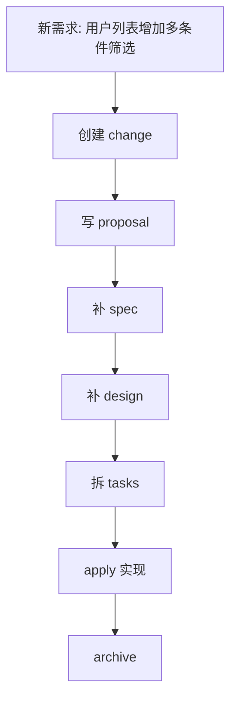

# OpenSpec 系统入门指南：从安装、目录结构到标准工作流

> 本文以 2026 年 3 月 24 日查阅的 OpenSpec 官网与 GitHub README 为主要依据，目标是给出一篇更适合作为长期底稿的系统入门文。重点放在主线、概念边界、目录结构、工作流和易错点，不追求“热闹”，追求“讲清楚”。

## 1. OpenSpec 的定位

OpenSpec 官方将自己定位为一个面向 AI 编程的 **spec-driven development toolkit**。  
它不是新的大模型，也不是新的 IDE，而是一层放在 AI 编码工具之上的规范管理层。

它有两个鲜明特点：

- **Brownfield-first**：对已有项目友好，强调在现有工程里落地
- **Tool-agnostic**：不强绑某个单一工具，Claude Code、Codex、Cursor、OpenCode、Windsurf 等都可以接入

理解 OpenSpec，最核心的一点是：

> 它的目标不是替你“生成文档”，而是把需求、规格、设计和任务拆解成可复用的项目上下文，然后再让 AI 围绕这些工件执行。

## 2. OpenSpec 解决的核心问题

在 AI Coding 场景里，很多问题并不是“代码不会写”，而是“上下文不稳定”。

常见症状包括：

- 新会话一开，AI 不记得之前为什么这么设计
- 功能做到一半被打断，恢复上下文成本很高
- 同一需求在不同轮对话里被实现成不同版本
- AI 改一个点时，顺带把别的地方也改了

这些问题的共同根源是：

- 需求没有被稳定表达
- 边界条件没有被结构化沉淀
- 实现任务没有被拆成可执行路径
- 项目决策没有形成跨会话可复用的上下文

OpenSpec 的方法是：**先定义变更，再执行变更；先固定意图，再开始编码。**

## 3. 官方资料里为什么会同时出现 `/openspec:*` 和 `/opsx:*`

截至 **2026 年 3 月 24 日**，官方公开资料里能看到两套入口。

| 来源 | 入口 | 说明 |
| --- | --- | --- |
| `openspec.dev` 官网 Getting Started | `/openspec:proposal`、`/openspec:apply`、`/openspec:archive` | 官网标准入门主线 |
| GitHub README 顶部 Quick Start | `/opsx:propose`、`/opsx:apply`、`/opsx:archive` | 仓库正在主推的新 workflow |
| GitHub README Experimental Features | `/opsx:new`、`/opsx:continue`、`/opsx:ff` 等 | 更细粒度的扩展能力 |

因此更准确的理解方式是：

- `/openspec:*` 更适合用来理解标准主线
- `/opsx:*` 更适合用来理解新 workflow 和扩展能力

如果是第一次接触 OpenSpec，建议先理解标准主线，再去看 OPSX。

## 4. 安装与初始化

### 前置要求

- Node.js `20.19.0+`

### 安装

```bash
npm install -g @fission-ai/openspec@latest
```

### 初始化项目

```bash
cd your-project
openspec init
```

初始化过程中，OpenSpec 会让你选择要集成的 AI 工具，并自动写入相应的命令入口和说明文件。

根据官方文档，初始化后的关键结果包括：

- 新增 `openspec/` 目录
- 为所选 AI 工具注入命令入口
- 生成托管的 `AGENTS.md`
- 建议补齐 `openspec/project.md`，作为项目级上下文

## 5. 初始化后的目录结构

一个典型结构如下：

```text
openspec/
├── project.md
├── specs/
│   ├── auth/
│   │   └── spec.md
│   └── billing/
│       └── spec.md
└── changes/
    ├── archive/
    └── add-profile-filters/
        ├── proposal.md
        ├── tasks.md
        ├── design.md
        └── specs/
            └── profile/
                └── spec.md
```

这里最关键的是理解两个目录：

| 目录 | 含义 |
| --- | --- |
| `openspec/specs/` | 当前系统已经生效的主规格 |
| `openspec/changes/` | 正在筹备、实现或等待归档的变更 |

可以简化理解为：

- `specs/` 负责描述“系统现在是什么样”
- `changes/` 负责描述“系统接下来要怎么改”

这种分层的价值在于：

- 避免把当前状态和待开发状态混在一起
- 支持多个变更并行推进
- 归档后能让主规格自然演进

## 6. 主要工件及其职责

| 工件 | 作用 | 常见内容 |
| --- | --- | --- |
| `proposal.md` | 说明为什么要做这次变更 | 背景、目标、范围、非目标 |
| `specs/**/spec.md` | 定义行为与验收标准 | Requirement、Scenario、边界条件 |
| `design.md` | 记录实现设计 | 架构、接口、数据流、风险、取舍 |
| `tasks.md` | 把工作拆成执行步骤 | 子任务、顺序、完成状态 |

这里要特别强调两点：

### `proposal.md` 不是需求口号

它的价值不在于写得“像文档”，而在于帮助人和 AI 对齐：

- 为什么做
- 做到哪里
- 哪些不做

### `spec.md` 不是随手备注

OpenSpec 的规格文件强调结构化表达。按官方示例，常见片段包括：

| 片段 | 用途 |
| --- | --- |
| `## ADDED Requirements` | 新增能力 |
| `## MODIFIED Requirements` | 调整已有能力 |
| `## REMOVED Requirements` | 移除旧能力 |
| `### Requirement:` | 单条能力约束 |
| `#### Scenario:` | 用具体场景消除歧义 |

这意味着 `spec.md` 的重点不是“描述很完整”，而是“边界是否足够明确、可执行、可检验”。

## 7. 标准主线工作流

理解 OpenSpec，最重要的是先理解标准主线。


### 7.1 Proposal

先定义变更，而不是直接要求 AI 写代码。

这一阶段的目标包括：

- 明确目标
- 明确范围与非目标
- 确认要新增或修改哪些规格
- 初步拆分任务

### 7.2 Review

这是最容易被忽略，但非常关键的阶段。

审核重点包括：

- 边界条件是否完整
- 是否影响既有行为
- 命名和拆分是否合理
- 是否把需求问题与实现问题混在一起

### 7.3 Apply

进入 `apply` 之后，AI 不再是“围绕一句需求自由发挥”，而是围绕现成的规格和任务执行。

这一步的优势是：

- 目标更稳定
- 返工成本更低
- 多轮会话下上下文更容易恢复

### 7.4 Archive

归档不是简单移动文件，而是在做两件事情：

1. 保留本次变更的可追溯历史
2. 把已确认生效的规格合并进主 `specs/`

归档完成后，项目的主规格库就会成为下一次协作的新起点。

## 8. 在不同工具中如何触发

按官方 Supported Tools 表，可以先这样理解：

| 工具 | 常见入口 | 说明 |
| --- | --- | --- |
| Claude Code | `/openspec:proposal`、`/openspec:apply`、`/openspec:archive` | 官网标准入口 |
| Codex / Cursor / OpenCode / Windsurf 等 | `/openspec-proposal`、`/openspec-apply`、`/openspec-archive` | 由 `openspec init` 自动注入 |
| 新 workflow 快速入口 | `/opsx:propose`、`/opsx:apply`、`/opsx:archive` | GitHub README 顶部 Quick Start |
| Claude Code 扩展入口 | `/opsx:new`、`/opsx:continue`、`/opsx:ff`、`/opsx:apply`、`/opsx:archive` | 更细粒度 OPSX 扩展 |

如果只是先上手，建议关注标准入口，不必一开始记所有命令变体。

## 9. 需要记住的核心 CLI

对大多数用户，先记住下面这些已经足够：

| 命令 | 作用 |
| --- | --- |
| `openspec init` | 初始化 OpenSpec |
| `openspec update` | 更新工具集成与指令文件 |
| `openspec list` | 查看变更或规格 |
| `openspec show <item>` | 查看详情 |
| `openspec validate <item>` | 校验结构 |
| `openspec archive <change>` | 归档已完成变更 |
| `openspec view` | 打开交互式视图 |

## 10. OPSX 适合什么场景

OPSX 更适合那些希望对 Artifact 生成顺序做细粒度控制的团队。

它的大致流程如下：


根据官方资料，OPSX 还需要单独执行：

```bash
openspec artifact-experimental-setup
```

适用场景包括：

- 需求仍在探索，想逐个 Artifact 推进
- 团队需要分阶段审 proposal、spec、design
- 团队希望更强地自定义模板和依赖关系

如果你现在的目标只是“跑通 OpenSpec”，标准主线通常已经足够。

## 11. 一个实战化理解方式

假设你要给后台用户列表增加筛选能力：

- 按角色筛选
- 按团队筛选
- 支持组合筛选
- 刷新后保留筛选条件

标准 OpenSpec 的做法不是直接让 AI 改列表页，而是先把变更拆清楚：



这样做的意义是：

- 实现前先固定边界
- 中断后可快速恢复上下文
- 多人协作时更容易接力
- 归档后可以沉淀为长期可复用资产

## 12. 常见误区

### 12.1 把 OpenSpec 当成文档生成器

如果只生成文档，不审、不按任务执行、不归档，那么它的价值会被大幅削弱。

### 12.2 Proposal 很热闹，Spec 很空

真正决定 AI 会不会跑偏的，通常不是背景描述，而是 `spec.md` 是否把行为和边界说清楚。

### 12.3 跳过 Review

很多返工并不是代码问题，而是规格阶段漏掉了边界条件。

### 12.4 一上来就研究 OPSX

如果标准主线还没跑顺，过早研究实验性扩展，容易把注意力从“核心模型”转移到“命令细节”上。

### 12.5 只记命令，不理解分层

命令入口会随版本迭代而变化，但 `specs/`、`changes/`、`archive` 这套分层逻辑更稳定，也更值得优先掌握。

## 13. 结论

OpenSpec 最值得学习的，不是某条命令，也不是某个工具截图，而是一套规范驱动协作的思路：

- 把意图沉淀进项目，而不是停留在聊天窗口
- 把边界写成规格，而不是留给 AI 猜
- 把执行路径变成任务，而不是让 AI 即兴发挥
- 把变更结果归档回主规格，而不是让经验散落在会话里

从这个角度看，OpenSpec 的意义并不只是“让 AI 多写一点代码”，而是让 AI Coding 从一次性的对话行为，变成可追溯、可复用、可协作的工程流程。

## 参考来源

### 官方资料

- OpenSpec 官网：<https://openspec.dev/>
- OpenSpec GitHub 仓库：<https://github.com/Fission-AI/OpenSpec>

### 辅助参考

- `优秀文章/OpenSpec-1.md`
- `优秀文章/OpenSpec-2.md`
- `优秀文章/OpenSpec-3.md`
