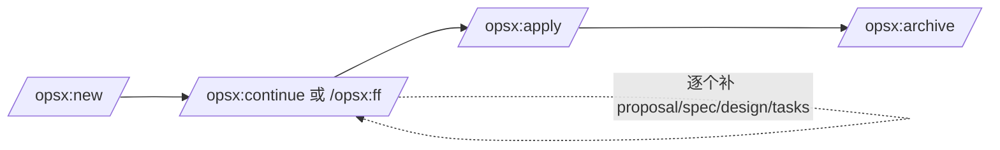
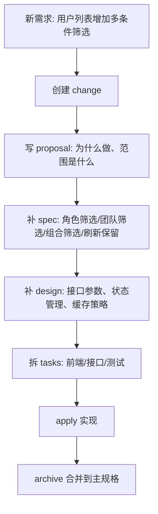

# Vibe Coding 必备？OpenSpec 这套规范驱动开发，到底怎么用

> 本文以 2026 年 3 月 24 日查阅的 OpenSpec 官网与 GitHub README 为主要依据，辅以其他文章做结构和表达层面的参考。重点不是“搬运命令”，而是把 OpenSpec 的主线、边界和使用场景讲清楚。

## 1. OpenSpec 到底解决什么问题？

很多人第一次用 AI 写代码，都会先经历一个短暂的蜜月期：

- 让它写页面，很快
- 让它补接口，也很快
- 让它修一个局部报错，往往也能对

但一旦项目开始变复杂，问题马上出现：

- 新开一个对话，AI 不记得前面为什么这么设计
- 做到一半被打断，回来后很难接着上次的思路继续
- 改一个功能，AI 顺手把别的地方也“优化”了
- 同一个需求，今天和明天问出来的方案都可能不一样

问题的根子通常不是模型不够强，而是**开发意图没有被稳定沉淀下来**。

OpenSpec 想解决的，正是这件事。

它的核心思路不是“让 AI 更会写代码”，而是先把**需求、边界、设计决策和任务拆解**变成结构化工件，再让 AI 按这些工件执行。这样，项目里真正可复用、可审查、可归档的东西，不再只是代码，还包括“为什么这么做”。

一句话概括：

> OpenSpec 不是新的 IDE，也不是新的模型，而是一层放在 AI 编码工具之上的“规范管理层”。

## 2. OpenSpec 是什么，不是什么

OpenSpec 官方把它定位为一个面向 AI 编程的 **spec-driven development toolkit**。它特别强调两点：

- **Brownfield-first**：对已有项目友好，不要求你从零换技术栈
- **Tool-agnostic**：不强绑某一个 AI 编码工具，Claude Code、Codex、Cursor、OpenCode、Windsurf 等都能接

它不是什么？

- 不是项目管理平台
- 不是需求系统替代品
- 不是“写个提示词就自动出完美代码”的魔法盒子

它更像是一个规范化的中间层：

1. 先把变更定义清楚
2. 再让 AI 按定义生成和实现
3. 完成后把结果归档回项目主规格

这套做法的价值，在项目变大、多人协作、需求反复变化时会越来越明显。

## 3. 先说一个关键事实：官方资料里现在能同时看到两套入口

如果你最近在搜 OpenSpec，很容易被一个问题绕晕：  
为什么有的地方写 `/openspec:proposal`，有的地方又写 `/opsx:propose`？

截至 **2026 年 3 月 24 日**，我查到的官方公开资料里，确实能同时看到这两套表达：

| 来源 | 你会看到什么 | 说明 |
| --- | --- | --- |
| `openspec.dev` 官网 Getting Started | `/openspec:proposal`、`/openspec:apply`、`/openspec:archive` | 这是官网示例里的标准主线 |
| GitHub README 顶部 Quick Start | `/opsx:propose`、`/opsx:apply`、`/opsx:archive` | 这是仓库首页正在主推的新 workflow |
| GitHub README 下半段 Experimental Features | `/opsx:new`、`/opsx:continue`、`/opsx:ff` 等 | 这是更细粒度的扩展能力 |

所以，最稳妥的写法不是简单说“只有一套命令”，而是把它解释清楚：

- **`/openspec:*`**：官网标准入门主线，最适合第一次接触的人理解 OpenSpec 的基本模型
- **`/opsx:*`**：仓库 README 正在推进的新工作流与扩展命令体系

为了让主线清楚，下面正文我会先按 **标准 OpenSpec 思路** 解释核心概念，再单独补充 **OPSX**。

## 4. 安装与初始化

### 前置要求

- Node.js `20.19.0+`

### 安装

```bash
npm install -g @fission-ai/openspec@latest
```

### 初始化

```bash
cd your-project
openspec init
```

初始化时，OpenSpec 会让你选择要集成的 AI 工具，然后自动把对应的命令入口和说明写进项目环境里。官方资料里反复强调的一点是：**你不需要手工抄模板搭目录，OpenSpec 会先把工作流骨架装好。**

初始化后，项目里最核心的是新增一个 `openspec/` 目录；同时还会生成一份托管的 `AGENTS.md` 交接说明，方便兼容这类会自动读取项目说明的 AI 工具。官方文档还建议你补齐 `openspec/project.md`，把技术栈、架构约定和团队规范写进去，作为项目级上下文。

## 5. 初始化后会多出什么？

一个典型的目录大致长这样：

```text
openspec/
├── project.md
├── specs/
│   ├── auth/
│   │   └── spec.md
│   └── billing/
│       └── spec.md
└── changes/
    ├── archive/
    └── add-profile-filters/
        ├── proposal.md
        ├── tasks.md
        ├── design.md
        └── specs/
            └── profile/
                └── spec.md
```

这里最重要的不是“文件多了”，而是你要理解它背后的分层。

### `specs/` 和 `changes/` 分别代表什么？

| 目录 | 含义 | 你可以把它理解成什么 |
| --- | --- | --- |
| `openspec/specs/` | 当前系统已经生效的主规格 | “系统现在是什么样” |
| `openspec/changes/` | 正在筹备、实现或等待归档的变更 | “我们准备怎么改” |

这就是 OpenSpec 最核心的设计之一：**把“当前真实状态”和“即将发生的变更”分开管理。**

这样做有三个直接好处：

- AI 不容易把历史状态和待开发状态混在一起
- 多个变更可以并行推进，不必互相污染上下文
- 归档之后，主规格库会自动变成下一轮协作的起点

### 每类工件各管什么？

| 工件                 | 作用          | 关注点             |
| ------------------ | ----------- | --------------- |
| `proposal.md`      | 说明为什么要做这次变更 | 背景、目标、范围、非目标    |
| `specs/**/spec.md` | 定义行为和验收标准   | 用户场景、边界条件、输入输出  |
| `design.md`        | 记录实现设计      | 架构、数据流、接口、风险、取舍 |
| `tasks.md`         | 把工作拆成可执行步骤  | 实施顺序、依赖关系、完成状态  |

这里有一个很容易被忽略的点：

> `design.md` 不是每次都必须写得很重，但复杂变更里它很重要，因为它负责把“功能应该怎么表现”进一步转成“工程上准备怎么落地”。

## 6. `spec.md` 不是随便写的备注，它有自己的语法

这也是不少介绍文章容易略过的地方。

OpenSpec 的规格文件不是普通随笔，它强调**结构化描述行为**。按官方示例，规格通常会分成新增、修改、移除等部分，并围绕 Requirement 和 Scenario 组织。

常见结构可以这样理解：

| 片段 | 用途 |
| --- | --- |
| `## ADDED Requirements` | 描述这次新增了什么能力 |
| `## MODIFIED Requirements` | 描述对已有能力的调整 |
| `## REMOVED Requirements` | 描述哪些旧行为被废弃 |
| `### Requirement:` | 每条能力约束本体 |
| `#### Scenario:` | 用具体场景把模糊话说清楚 |

为什么这件事重要？

因为 AI 最怕“目标是对的，但边界是糊的”。  
一个 Requirement 如果没有 Scenario，往往就会变成“看起来有道理，但实现时有很多自由发挥空间”的半成品需求。

换句话说，OpenSpec 不是让你多写文档，而是逼你把**模糊意图压缩成可执行约束**。

## 7. 标准主线怎么走？

如果你只记住一张图，最好记住这张：


这条主线本质上是四步。

### 第一步：Proposal

先定义变更，而不是直接开写。

这一阶段最重要的成果不是代码，而是：

- 这次到底要解决什么问题
- 哪些属于范围内，哪些明确不做
- 需要新增或修改哪些规格
- 任务应该怎么拆

### 第二步：Review

这一步很多人最容易省掉，但恰恰最关键。

你真正要审的，不只是 AI 写得像不像文档，而是：

- 边界条件有没有漏
- 旧行为是否会被影响
- 命名和拆分是否合理
- 有没有把“应该做什么”和“怎么实现”混为一谈

如果这个阶段偷懒，后面的 `apply` 往往会变成高成本返工。

### 第三步：Apply

`apply` 的价值不是“自动写代码”这件事本身，而是**让 AI 围绕现成任务和规格执行**。  
这和直接说一句“帮我实现 XX 功能”是两种完全不同的工作模式。

前者更像：

- 先有蓝图
- 再按蓝图施工
- 施工过程中有任务顺序和验收依据

后者更像：

- 先出手
- 写偏了再回头修
- 对话一长，原始约束越来越模糊

### 第四步：Archive

归档是 OpenSpec 非常关键但也非常容易被低估的一步。

它不是简单“把旧文件挪个地方”，而是在做两件事：

1. 把本次变更沉淀为可追溯历史
2. 把已经确认生效的规格并入 `openspec/specs/`

归档之后，下一次 AI 再接手这个项目时，看到的是更新后的主规格，而不是散落在聊天记录里的历史讨论。

## 8. 在不同工具里怎么触发？

你原稿里这一部分最大的风险，是把工具目录、命令前缀和实验工作流揉在一起了。为了减少过时和误导，更建议按“命令入口”来讲，而不是按隐藏目录来讲。

按官方 Supported Tools 表，常见入口可以先这么记：

| 工具                                     | 常见命令入口                                                                | 说明                                |
| -------------------------------------- | --------------------------------------------------------------------- | --------------------------------- |
| Claude Code                            | `/openspec:proposal`、`/openspec:apply`、`/openspec:archive`            | 官网 Getting Started 里的标准入口         |
| Codex / Cursor / OpenCode / Windsurf 等 | `/openspec-proposal`、`/openspec-apply`、`/openspec-archive`            | 具体注入方式由 `openspec init` 自动处理      |
| 新 workflow 快速入口                        | `/opsx:propose`、`/opsx:apply`、`/opsx:archive`                         | GitHub README 顶部 Quick Start 正在主推 |
| Claude Code 实验扩展                       | `/opsx:new`、`/opsx:continue`、`/opsx:ff`、`/opsx:apply`、`/opsx:archive` | 这是更细粒度的 OPSX 扩展                   |

如果你文章面向新手，最稳的讲法是：

- 先告诉读者“初始化后会给工具注入快捷命令”
- 再告诉读者“官网标准入口是 `/openspec:*`，仓库 README 里又新增了 `/opsx:*` 系列”
- 不要把所有隐藏目录路径都当成必须记忆的重点

这样读者更容易抓住主线。

## 9. CLI 命令到底记哪些就够了？

没必要一上来背全命令树。对大多数人，先记住下面这些就够用：

| 命令 | 作用 |
| --- | --- |
| `openspec init` | 初始化 OpenSpec |
| `openspec update` | 更新工具集成与指令文件 |
| `openspec list` | 查看当前变更或规格 |
| `openspec show <item>` | 查看某个变更或规格详情 |
| `openspec validate <item>` | 校验变更或规格结构 |
| `openspec archive <change>` | 归档已完成变更 |
| `openspec view` | 打开交互式视图 |

如果你只是想把 OpenSpec 跑起来，这几个已经覆盖 80% 的日常动作。

## 10. OPSX 值得讲，但要把它讲成“扩展能力”和“新工作流”

如果你只想先跑通 OpenSpec，先用官网那套标准思路完全没问题。  
但如果你关注的是 GitHub README 里主推的新 workflow，或者你确实想更细粒度地控制 Artifact 生成顺序，OPSX 就很有价值。

可以把它理解成：把原本相对打包的规划阶段，进一步拆成可以单独推进的动作。



官方资料里明确把 OPSX 放在 Experimental Features 下，并给出了单独的安装入口：

```bash
openspec artifact-experimental-setup
```

它适合的通常是这几种情况：

- 需求还在探索中，想一个 Artifact 一个 Artifact 地推进
- 团队需要先审核 proposal，再审核 spec，再审核 design
- 你想自己定义 Artifact 依赖关系和模板

可以用一张表把它讲明白：

| OPSX 命令 | 作用 | 适合什么时候用 |
| --- | --- | --- |
| `/opsx:new` | 创建变更骨架 | 刚开始一个新变更 |
| `/opsx:continue` | 继续生成下一个 Artifact | 想逐步推进、逐步审核 |
| `/opsx:ff` | 一次性补齐规划文档 | 需求清晰、想快速进入实现 |
| `/opsx:apply` | 开始实施 | 规划工件已基本确认 |
| `/opsx:archive` | 归档完成变更 | 验收通过后 |

但有一句话必须说清楚：

> 如果你不准备研究 Artifact Workflow、自定义 schema 和模板，先用标准 OpenSpec 主线，通常已经足够。

## 11. 一个更贴近实战的例子

假设你要给一个已经上线的后台系统新增“用户列表筛选能力”，包括：

- 按角色筛选
- 按所属团队筛选
- 支持组合筛选
- 列表筛选条件刷新后保留

这时候，用 OpenSpec 的思路，不是直接让 AI 改列表页，而是这样走：



这套流程的关键价值在于：

- 当 AI 开始实现时，它拿到的不是一句模糊需求，而是一套已经拆清楚的约束
- 当你中途被打断时，回来后看的不是聊天记录，而是 `proposal.md`、`spec.md`、`tasks.md`
- 当团队里另一个人接手时，他也能直接从这套工件接着做，而不是重新理解你的上下文

## 12. 哪些地方最容易踩坑？

### 1. 把 OpenSpec 当成“文档生成器”

如果只是让它帮你生成几篇漂亮的 Markdown，但后面既不审、也不按任务执行、也不归档，那它的价值会大打折扣。

### 2. Proposal 写得很热闹，Spec 却很空

真正决定 AI 会不会跑偏的，往往不是漂亮的背景描述，而是 `spec.md` 里那些是否清晰、是否可检验的 Requirement 和 Scenario。

### 3. 直接跳过 Review

很多返工不是代码能力问题，而是规格阶段漏掉边界。  
把 10 分钟花在审规格上，往往能省掉后面 2 小时的回滚和重写。

### 4. 明明是标准工作流，却把 OPSX 当默认入口

这会让新读者产生一个误解：好像不用 `/opsx:*` 就不算会用 OpenSpec。其实不是。OPSX 是扩展，不是理解 OpenSpec 的必经之路。

### 5. 只看工具截图，不理解分层

命令菜单怎么显示、目录注入到哪里，这些会随着工具版本变化。  
但 `specs/` 是主规格、`changes/` 是待变更、`archive` 负责沉淀已完成结果，这些才是更稳定的认知框架。

## 13. 我的结论：OpenSpec 真正值钱的，不是命令，而是“先对齐再动手”

如果只把 OpenSpec 理解成几个斜杠命令，那它看起来不过是 AI 编码工具上的一层壳。

但如果你把它理解成一套规范驱动的协作机制，就会发现它真正解决的是下面这几个长期问题：

- 如何让需求讨论不在聊天窗口里蒸发
- 如何让 AI 的实现围绕明确边界，而不是围绕一段模糊提示词
- 如何让项目的“意图”和“行为”一起沉淀下来
- 如何让后续协作建立在主规格之上，而不是建立在记忆之上

说到底，OpenSpec 不是为了让你“多写文档”，而是为了让 AI 编码这件事，从一次性的对话行为，变成可持续复用的工程流程。

这才是它最值得学的地方。

## 参考来源

### 官方资料

- OpenSpec 官网：<https://openspec.dev/>
- OpenSpec GitHub 仓库：<https://github.com/Fission-AI/OpenSpec>


